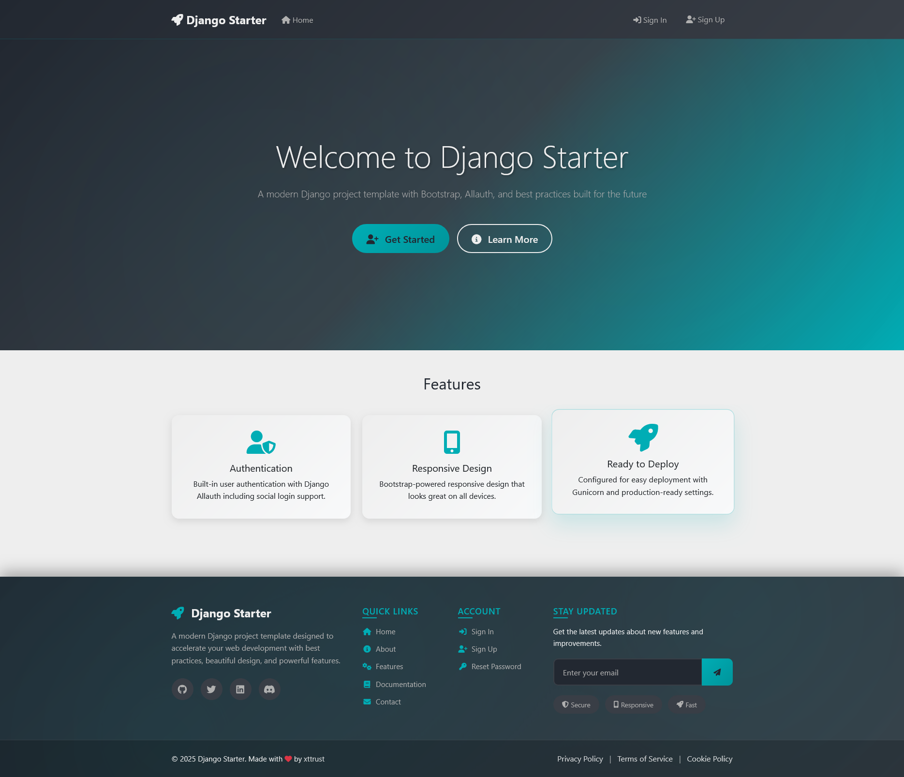
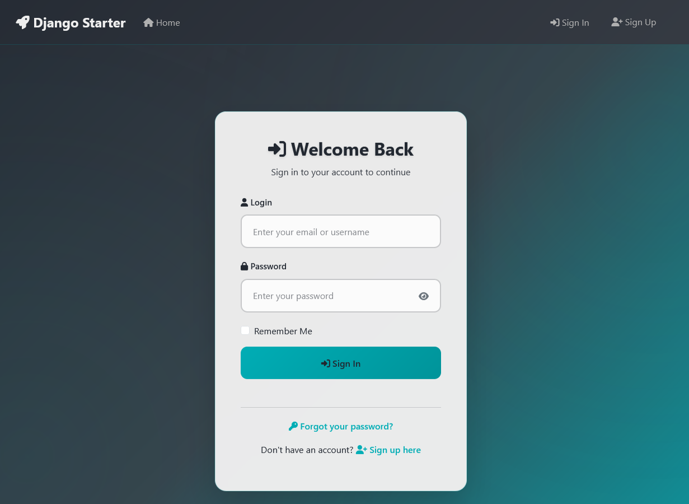
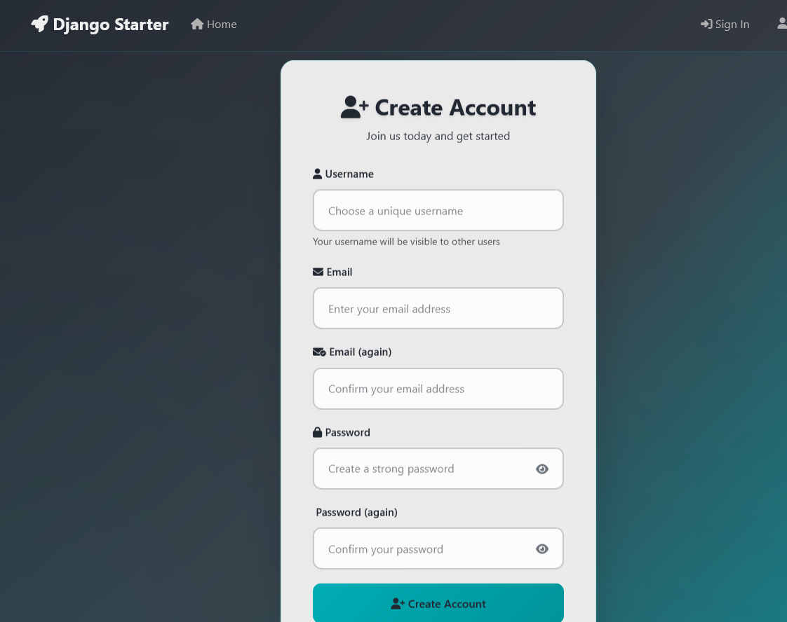
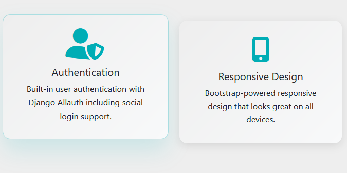

# 🚀 Modern Django Starter Template 🚀

[](https://www.djangoproject.com/)
[](https://www.python.org/)
[](https://getbootstrap.com/)
[](https://opensource.org/licenses/MIT)
[](https://github.com/xttrust/django-starter)
[](https://github.com/xttrust/django-starter)

**A modern, production-ready Django starter template that accelerates your web development process.**

✨ **Features:** Dark Theme • Animations • Authentication • Responsive Design • Production Ready

Built with best practices, this template provides a solid foundation for building scalable Django applications with authentication, responsive design, and deployment-ready configurations.

## 🎯 Quick Demo

```bash
git clone https://github.com/xttrust/django-starter.git
cd django-starter
python -m venv .venv && .venv\Scripts\activate
pip install -r requirements.txt && python manage.py migrate
python manage.py runserver
```

**→ Open [http://127.0.0.1:8000](http://127.0.0.1:8000) and see the magic! ✨**

## 📸 Screenshots

<table>
<tr>
<td align="center">

<br/><b>🏠 Modern Dark Theme Homepage</b>
</td>
<td align="center">

<br/><b>🔐 Beautiful Authentication Pages</b>
</td>
</tr>
<tr>
<td align="center">

<br/><b>📱 Fully Responsive Design</b>
</td>
<td align="center">

<br/><b>⚡ Smooth Animations & Effects</b>
</td>
</tr>
</table>

---

</div>

## 📚 Documentation

Complete guides for every development scenario:

| Guide | Description | Best For |
|-------|-------------|----------|
| 📖 **[Documentation Index](docs/README.md)** | **Start here** - Complete guide navigator | Everyone |
| 💻 **[Local Development](docs/local-development-guide.md)** | Simple setup with SQLite | Beginners, Quick development |
| 🐳 **[Docker Development](docs/docker-development-guide.md)** | Production-like containerized environment | Team development, Production testing |
| 🔄 **[Environment Switching](docs/environment-switching-guide.md)** | Easy switching between local and Docker | Daily development workflow |
| ⚡ **[Docker Quick Reference](docs/docker-quick-reference.md)** | Command cheat sheet | Docker power users |

### 🎯 Quick Start Options

#### 💻 Local Development (Recommended for beginners)
```bash
git clone https://github.com/xttrust/django-starter.git
cd django-starter
.\switch-to-local.bat  # Automatically configures local environment
python -m venv .venv && .venv\Scripts\activate
pip install -r requirements.txt && python manage.py migrate
python manage.py runserver  # → http://127.0.0.1:8000
```

#### 🐳 Docker Development (Recommended for teams)
```bash
git clone https://github.com/xttrust/django-starter.git
cd django-starter
.\switch-to-docker.bat  # Automatically configures Docker environment
docker-compose up --build  # → http://localhost:8000
```

> **💡 Tip:** Use the switching scripts to easily move between development modes! See the [Environment Switching Guide](docs/environment-switching-guide.md) for details.

## ✨ Features

### 🔧 Core Framework

- **Django 5.1.2**: Latest stable Django framework with enhanced performance and security
- **Python 3.13+**: Modern Python version with improved performance and features
- **Flexible Database**: SQLite for local development, PostgreSQL for Docker/production

### 🐳 Docker & Production

- **Multi-Container Setup**: Django + PostgreSQL + Redis + Nginx
- **Production Ready**: Gunicorn WSGI server with proper configuration
- **Health Checks**: Container health monitoring and auto-restart
- **Static Files**: Automated collection and serving via Nginx
- **Environment Switching**: Easy toggle between local and Docker development

### 🔐 Authentication & Security

- **Django Allauth 65.1.0**: Complete authentication solution with:
  - Email verification
  - Social authentication support (Google, Facebook, GitHub, etc.)
  - Password reset functionality
  - User registration and login
- **CSRF Protection**: Built-in cross-site request forgery protection
- **Security Headers**: Configured security middleware

### 🎨 Frontend & Styling

- **Bootstrap 5.3.3**: Modern, responsive CSS framework
- **Font Awesome 6.6.0**: Comprehensive icon library
- **Animate.css 4.1.1**: CSS animation library for smooth transitions
- **Modern Dark Theme**: Custom color palette with cyan accents
  - Dark Primary: `#222831`
  - Dark Secondary: `#393E46`
  - Accent Cyan: `#00ADB5`
  - Light Gray: `#EEEEEE`
- **Advanced Animations**: Glass morphism effects, hover transitions, and micro-interactions
- **Custom CSS/JS**: Organized static files structure with custom stylesheets and JavaScript
- **SEO Optimized**: Meta tags for search engines and social media sharing

### 🗂️ Project Structure

- **Modular Apps**: Clean separation with dedicated `home` app
- **Template Inheritance**: Well-structured base template with extensible blocks
- **Static Files Management**: Organized CSS, JavaScript, and image directories
- **Production Ready**: Gunicorn configuration and static files collection

## 📋 Requirements

This project requires Python 3.13+ and the following dependencies:

```txt
asgiref==3.8.1
Django==5.1.2
django-allauth==65.1.0
gunicorn==23.0.0
packaging==24.1
psycopg2-binary==2.9.10
sqlparse==0.5.1
tzdata==2024.2
```

## � Environment Management

### Automated Environment Switching

Switch between local (SQLite) and Docker (PostgreSQL) development with one click:

| Script | Environment | Database | Purpose |
|--------|-------------|----------|---------|
| `switch-to-local.bat` | Local Development | SQLite | Fast development, debugging |
| `switch-to-docker.bat` | Docker Development | PostgreSQL | Production-like testing |

```bash
# Switch to local development
.\switch-to-local.bat

# Switch to Docker development  
.\switch-to-docker.bat
```

**What the scripts do:**
- ✅ Automatically configure environment variables
- ✅ Backup existing database (Docker mode)
- ✅ Switch database settings
- ✅ Provide clear next steps

> 📖 **Detailed Guide**: See [Environment Switching Guide](docs/environment-switching-guide.md) for complete workflows and troubleshooting.

## 🚀 Development Setup

### Option 1: Local Development (Recommended for beginners)

**Perfect for learning Django and rapid prototyping.**

```bash
# 1. Clone and setup
git clone https://github.com/xttrust/django-starter.git
cd django-starter

# 2. Switch to local environment
.\switch-to-local.bat

# 3. Setup Python environment
python -m venv .venv
.\.venv\Scripts\activate
pip install -r requirements.txt

# 4. Initialize database
python manage.py migrate
python manage.py createsuperuser

# 5. Start development server
python manage.py runserver
# → Visit: http://127.0.0.1:8000
```

### Option 2: Docker Development (Recommended for teams)

**Production-like environment with PostgreSQL, Redis, and Nginx.**

```bash
# 1. Clone and setup
git clone https://github.com/xttrust/django-starter.git
cd django-starter

# 2. Switch to Docker environment
.\switch-to-docker.bat

# 3. Start containers
docker-compose up --build -d

# 4. Initialize database (first time only)
docker-compose exec web python manage.py migrate
docker-compose exec web python manage.py createsuperuser

# → Visit: http://localhost:8000
```

### Development Admin Account

For **development purposes only**, a default admin account is included:

- **Username**: `admin`
- **Password**: `@MyLocalSuper`
- **Access**: Visit `/admin/` to login

> ⚠️ **SECURITY WARNING**: This is for development only! Always create new admin accounts for production environments with strong, unique passwords.

### 6. Collect Static Files (for production)

```bash
python manage.py collectstatic --noinput
```

### 7. Run Development Server

```bash
python manage.py runserver
```

Visit `http://127.0.0.1:8000/` to see your application running!

## � Docker Deployment

### Production Deployment with Docker

For production deployment, use the Docker setup:

```bash
# 1. Clone repository
git clone https://github.com/xttrust/django-starter.git
cd django-starter

# 2. Configure production environment
cp .env.example .env
# Edit .env with your production settings

# 3. Deploy with Docker Compose
docker-compose -f docker-compose.yml up -d --build

# 4. Initialize production database
docker-compose exec web python manage.py migrate
docker-compose exec web python manage.py collectstatic --noinput
docker-compose exec web python manage.py createsuperuser
```

### Docker Architecture

```
┌─────────────────┐    ┌─────────────────┐    ┌─────────────────┐
│     Nginx       │    │     Django      │    │   PostgreSQL    │
│   (Port 8000)   │────│   (Port 8000)   │────│   (Port 5432)   │
│  Load Balancer  │    │  Gunicorn WSGI  │    │   Database      │
└─────────────────┘    └─────────────────┘    └─────────────────┘
                                │
                       ┌─────────────────┐
                       │      Redis      │
                       │   (Port 6379)   │
                       │     Cache       │
                       └─────────────────┘
```

**Features:**
- **Multi-container orchestration** with health checks
- **Nginx reverse proxy** for static files and load balancing
- **PostgreSQL database** with persistent volumes
- **Redis caching** for sessions and performance
- **Auto-restart policies** for production reliability

### Environment Configuration

Create a `.env` file for production:

```bash
# Django Configuration
DEBUG=False
SECRET_KEY=your-super-secret-production-key
ALLOWED_HOSTS=yourdomain.com,www.yourdomain.com

# Database (PostgreSQL)
DB_NAME=django_starter_prod
DB_USER=postgres
DB_PASSWORD=secure-database-password
DB_HOST=db
DB_PORT=5432

# Redis
REDIS_URL=redis://redis:6379/1

# Email (for production)
EMAIL_BACKEND=django.core.mail.backends.smtp.EmailBackend
EMAIL_HOST=smtp.your-email-provider.com
EMAIL_PORT=587
EMAIL_USE_TLS=True
EMAIL_HOST_USER=your-email@yourdomain.com
EMAIL_HOST_PASSWORD=your-email-password
```

## �📁 Project Structure

```bash
django-starter/
├── 📁 core/                    # Main project configuration
│   ├── settings.py            # Django settings
│   ├── urls.py               # URL routing
│   ├── wsgi.py               # WSGI configuration
│   └── asgi.py               # ASGI configuration
├── 📁 home/                   # Home application
│   ├── views.py              # View functions
│   ├── urls.py               # App-specific URLs
│   ├── models.py             # Database models
│   └── 📁 templates/home/    # App templates
├── 📁 templates/             # Global templates
│   ├── base.html             # Base template with SEO meta tags
│   └── 📁 account/           # Allauth templates
├── 📁 static/                # Static files (development)
│   ├── 📁 css/               # Custom stylesheets
│   ├── 📁 js/                # Custom JavaScript
│   └── 📁 images/            # Image assets
├── 📁 staticfiles/           # Collected static files (production)
├── requirements.txt          # Python dependencies
├── manage.py                # Django management script
└── Procfile                 # Deployment configuration
```

## ⚙️ Configuration Details

### Django Settings (`core/settings.py`)

- **DEBUG**: Set to `True` for development, change to `False` for production
- **ALLOWED_HOSTS**: Currently set to `['*']` for development
- **STATIC_URL**: `/static/` for serving static files
- **STATICFILES_DIRS**: Points to development static files directory
- **STATIC_ROOT**: Collection directory for production static files

### Template System

- **Base Template**: `templates/base.html` includes:
  - SEO-optimized meta tags
  - Open Graph and Twitter Card support
  - Responsive viewport configuration
  - Bootstrap and Font Awesome integration
  - Extensible template blocks

### Authentication

- **Allauth Configuration**: Pre-configured for email-based authentication
- **Login/Logout URLs**: Integrated with Django's authentication system
- **User Registration**: Email verification required by default

## 🎨 Frontend Features

### Custom Styling

- **CSS Variables**: Organized color scheme and theming
- **Responsive Design**: Mobile-first approach with Bootstrap
- **Custom Components**: Enhanced form controls and buttons

### JavaScript Functionality

- **Smooth Scrolling**: Enhanced navigation experience
- **Message System**: Toast notifications for user feedback
- **Newsletter Integration**: Email collection with console logging
- **Progressive Enhancement**: Graceful degradation for better accessibility

### 📦 UI Kit Component Status (Implemented)

The UI Kit located under `themes/ui-kit/` ships with a comprehensive set of themed demo components:

- Core Layout & Content: Buttons, Badges, Alerts, Forms, Auth Panels, Navbars, Hero Variants, Pricing Cards, Tables, Timeline, Steps, Footers
- Structure & Navigation: Accordions, Tabs (simplified styling), Carousels, Mega Menu, Pagination, Breadcrumbs
- Interactive / Overlay: Tooltips, Popovers, Modals, Offcanvas, Toasts
- Inputs & Feedback: Range Slider, File Upload (drag & drop), Spinners, Progress Bars
- Marketing & Content Blocks: Product Cards, Comparison Table, Blog Cards, Stats, Testimonials Slider, Team Cards, Gallery Mosaic, CTA Banners, Feature Grids, Logo Grids, FAQ Blocks, Newsletter Boxes
- Utilities: Elevation / Hover effects, Glass / Gradient utilities, Scroll To Top, Theme Toggle (light/dark) persistence, Spacing & Width helpers
- Engagement & UX: Floating Action Button (FAB), Share Icon Set, Cookie Consent Banner (localStorage persistence)

Newly added components in the latest batch (Product Cards, Comparison Table, Blog Cards, FAB, Share Icons, Cookie Banner) are fully implemented with dark/light theme support and accessible markup. Tab styles were cleaned up to remove duplicate CSS and the previous decorative underline pseudo-element for a sleeker look.


### Newsletter Functionality

The footer includes a newsletter signup form that demonstrates form handling:

- **Email Collection**: Users can enter their email address in the footer newsletter form
- **Client-Side Validation**: HTML5 email validation ensures proper format
- **Visual Feedback**: Loading spinner and success message provide user feedback
- **Console Logging**: For development purposes, submitted emails are logged to the browser console

**📝 Development Note**: The newsletter form currently outputs data to the browser console (`console.log('Newsletter signup:', email)`). In production, you would replace this with:

- Database storage (create a `Newsletter` model)
- Email service integration (Mailchimp, SendGrid, etc.)
- API endpoint for handling subscriptions

**🔧 To see newsletter data:**

1. Open your browser's Developer Tools (F12)
2. Go to the Console tab
3. Submit an email through the footer newsletter form
4. Check the console output for the collected email data

### Template Blocks

The base template provides these extensible blocks:

- ``: Additional meta tags
- ``: Page-specific stylesheets
- ``: Main page content
- ``: Page-specific JavaScript
- ``: Scripts that run after page load

## � Security Considerations

### Development vs Production Credentials

This README includes development credentials for convenience during setup. **This is NOT a security best practice for production environments.** Here's why and what you should do:

#### ❌ What NOT to do in Production

- **Never use default passwords** like `@MyLocalSuper`
- **Never commit real credentials** to version control
- **Don't use personal emails** in public repositories
- **Avoid predictable usernames** like project names

#### ✅ Security Best Practices

1. **Environment Variables**: Store sensitive data in environment variables

   ```bash
   # Use .env files (never commit these!)
   DJANGO_SECRET_KEY=your-random-secret-key
   DATABASE_URL=your-database-url
   ADMIN_EMAIL=your-secure-admin@yourdomain.com
   ```

2. **Strong Passwords**: Use password managers to generate secure passwords
   - Minimum 12 characters
   - Mix of uppercase, lowercase, numbers, and symbols
   - Unique for each service

3. **Email Privacy**: For public repositories:
   - Use placeholder emails like `admin@yourdomain.com`
   - Or use GitHub's no-reply email: `username@users.noreply.github.com`
   - Never expose personal emails in public code

4. **Production Admin Setup**:

   ```bash
   # Always create new admin accounts for production
   python manage.py createsuperuser
   # Use organization emails, not personal ones
   # Example: admin@yourcompany.com
   ```

### Development Credentials Explanation

The development credentials provided (`xttrust` / `@MyLocalSuper`) are:

- **Safe for local development only**
- **Should be changed immediately** when deploying
- **Not connected to any real accounts**
- **Included for quick setup convenience**

> 💡 **Pro Tip**: Remove this entire section from your README when forking this project for your own use, and never commit real production credentials to version control.

## �🚀 Deployment

### Production Checklist

1. **Environment Variables**: Set `DEBUG=False` and configure `SECRET_KEY`
2. **Allowed Hosts**: Update `ALLOWED_HOSTS` with your domain
3. **Database**: Configure production database (PostgreSQL recommended)
4. **Static Files**: Run `python manage.py collectstatic`
5. **Security**: Review security settings and enable HTTPS

### Gunicorn Configuration

The project includes Gunicorn for production deployment:

```bash
gunicorn core.wsgi:application --bind 0.0.0.0:8000
```

## 🔧 Customization

### Adding New Apps

```bash
python manage.py startapp your_app_name
```

Don't forget to add your app to `INSTALLED_APPS` in `settings.py`.

### Custom Static Files

- Add CSS files to `static/css/`
- Add JavaScript files to `static/js/`
- Add images to `static/images/`
- Reference in templates: ``

### Extending Templates

```html




<link rel="stylesheet" href="">



<!-- Your content here -->

```

## 🤝 Contributing

1. Fork the repository
2. Create a feature branch: `git checkout -b feature-name`
3. Make your changes and commit: `git commit -m 'Add some feature'`
4. Push to the branch: `git push origin feature-name`
5. Submit a pull request

## 📄 License

This project is licensed under the MIT License - see the [LICENSE](LICENSE) file for details.

## 🐳 Docker Deployment

### Prerequisites

- Docker Engine 20.10+
- Docker Compose v2.0+

### Quick Docker Setup

```bash
# Clone repository
git clone https://github.com/xttrust/django-starter.git
cd django-starter

# Build and start containers
docker-compose up --build

# Access application
open http://localhost:8000
```

> 📖 **New to Docker?** Check out our comprehensive [Docker Development Guide for Beginners](docs/docker-development-guide.md) that explains everything step-by-step!

### Docker Services

| Service | Port | Description |
|---------|------|-------------|
| **web** | 8000 | Django application (Gunicorn) |
| **db** | 5432 | PostgreSQL database |
| **redis** | 6379 | Redis cache/sessions |
| **nginx** | 80 | Reverse proxy (production) |

### Development Commands

```bash
# Start services in background
docker-compose up -d

# View logs
docker-compose logs -f web

# Run Django commands
docker-compose exec web python manage.py migrate
docker-compose exec web python manage.py createsuperuser
docker-compose exec web python manage.py collectstatic

# Access database
docker-compose exec db psql -U django_user -d django_starter

# Stop services
docker-compose down

# Rebuild containers
docker-compose up --build --force-recreate
```

### Production Deployment

```bash
# Use production compose file
docker-compose -f docker-compose.yml -f docker-compose.prod.yml up -d

# Or set environment variables
export DEBUG=0
export SECRET_KEY=your-production-secret-key
docker-compose up -d
```

### Environment Variables

Create `.env` file from `.env.example`:

```bash
cp .env.example .env
```

Key variables:

- `DEBUG`: Set to `0` for production
- `SECRET_KEY`: Use strong secret key
- `DATABASE_URL`: PostgreSQL connection string
- `REDIS_URL`: Redis connection string
- `ALLOWED_HOSTS`: Comma-separated domain list

## 🆘 Support

If you encounter any issues or have questions:

- Create an issue on GitHub
- Check the Django documentation: <https://docs.djangoproject.com/>
- Review Allauth documentation: <https://django-allauth.readthedocs.io/>
- Docker documentation: <https://docs.docker.com/>

## 🙏 Acknowledgments

- Django team for the amazing framework
- Django Allauth contributors for authentication solutions
- Bootstrap team for responsive design components
- Font Awesome for comprehensive icon library
- Docker team for containerization platform

---

**Happy coding!** 🎉 Built with ❤️ by [xttrust](https://github.com/xttrust)
